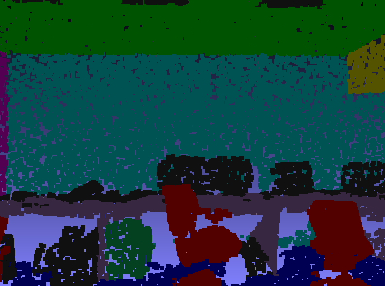

## Point Cloud Based Window Frame and Other Indoor Objects Detection
Created by Liuyue Xie, Zhenwei Liu, Yingjia Hu, Tiecheng Wang from Carnegie Mellon University

### Introduction
In this paper we present a complete pipeline to work directly with noisy raw point cloud data for classification and semantic segmentation tasks. The pipeline consists of two main components. The first component iteratively denoises the raw data based on Constrained Nonlinear Least Squares (NLSQ) normal estimation. The estimated surface normal is used to relocate noisy points in order to reduce outliers along the surface normals. The refined point cloud data produces finer surfaces and in turn further improves denoising and normal estimation results upon subsequent iterations. Our denoising algorithm successfully removed most outliers, while still retained important features of the point cloud data such  as edges, corners, etc.  

The second component utilizes modified network developed based on SpiderConv and PointNet feature extraction frameworks to perform classification and semantic segmentation. Based on the combined network of 3-layer SpiderCNN and PointNet, we test different parameters for the performance and exhibit detailed comparison with visualizations and diagrams to show our results.
